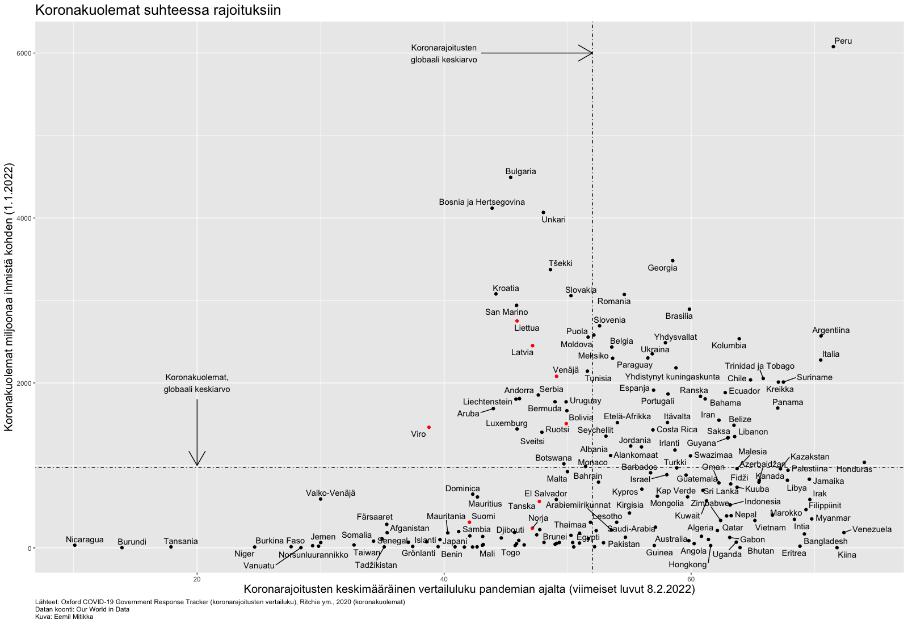
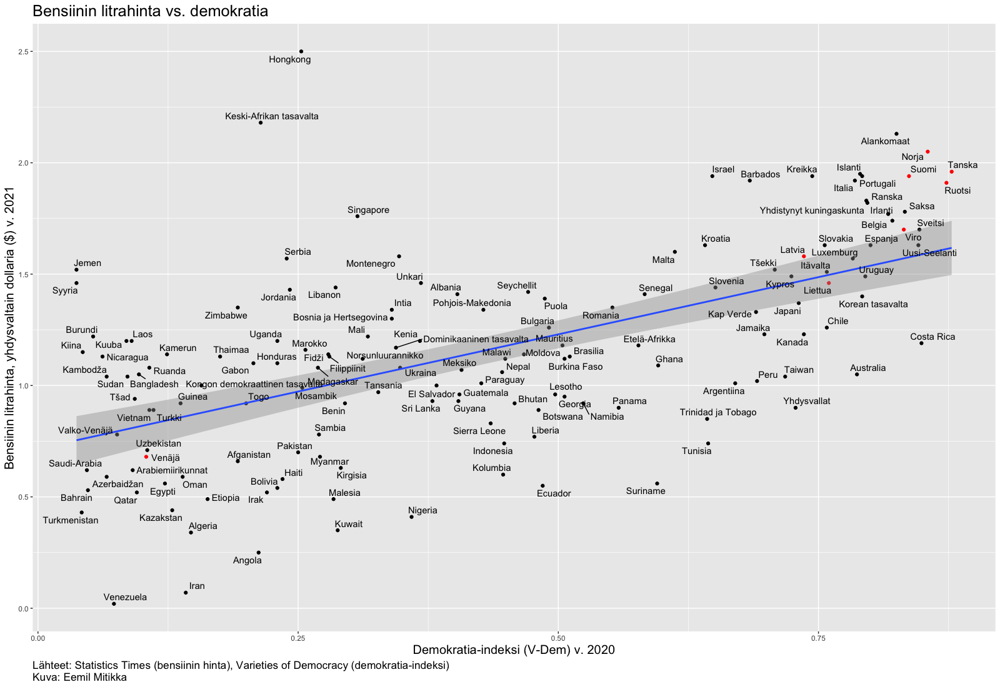
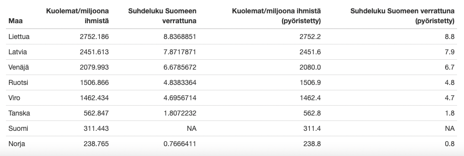

```{r setup, include=FALSE}
knitr::opts_chunk$set(echo = TRUE)
```

# Convoy-liike ja Suomen koronapolitiikka

Olen pitkin pandemiaa ihmetellyt joidenkin suomalaisten suhtautumista ja mielipiteitä Suomen koronapolitiikkaan liittyen. Nyt kun viime viikolla Convoy-liike rantautui tänne Suomeenkin, ajattelin tarkastella Suomen koronapolitiikkaa vähän tarkemmin kansainvälisessä vertailussa. Käyn alla läpi Convoy-liikkeen vaatimukset ja kommentoin näitä.

## 1. Koronarajoitusten poisto

Convoy-mielisten ensimmäinen vaatimus on koronarajoitusten poisto. Ihmettelen tätä vaatimusta, koska

-   rajoituksia ollaan jo poistamassa asteittain,
-   Suomessa on koko pandemian ajan ollut lievemmät suhteessa valtaosaan maailman maista [@owidcoronavirus] ja
-   Suomen koronarajoitukset ovat mitä ilmeisemmin toimineet suhteellisen hyvin, koska koronakuolleisuus on ollut Suomessa lähialueen maita matalampaa Norjaa lukuun ottamatta (ks. Kuva 1 ja Taulukko 1).



## 2. Polttoaineveron laskeminen

Bensan kallis kuluttajahinta on ollut Suomessa vakiopuheenaiheena viime aikojen keskustelussa. Ja pitäähän se paikkansa, että bensa on kallista Suomessa, mutta niin se on kaikissa muissakin lähialueen maissa. Ainoana poikkeuksena tähän on Venäjä, joka suurena öljyntuottajana pystyy tarjoamaan halvempia bensan kuluttajahintoja kansalaisilleen. Samaan aikaan myös ihmisoikeudet ja demokratia ovat halpoja Venäjällä, kuten valtaosassa suurista öljyn tuottajamaista [@statisticstimes2021a; @coppedge2021a], mikä puolestaan johtuu mm. [resurssikirouksena](https://fi.wikipedia.org/wiki/Luonnonvarojen_kirous) tunnetusta ilmiöstä. Lisäksi Suomen hallituksen polttoaineveropolitiikan sijaan bensan kalliiseen hintaan Suomessa tällä hetkellä vaikuttavat ensisijaisesti öljyn markkinahinnan moninkertaistuminen viime aikoina mm. Venäjän ja Ukrainan välisten geopoliittisen jännitteiden ja laajamittaisemman sodan uhan pelon takia [@cbsnews2022].



Toinen kysymys on, että jos polttoaineen verotusta alennetaan, niin mistä saadaan vastaavat verotulot? Katetaanko tämä lovi esim. leikkaamalla sosiaali- ja terveyspalveluista? Lisäämällä muita veroja? Vai näiden yhdistelmällä? En myöskään tiedä kuinka tavoiteltavaa matalat polttoaineen hinnat ovat maailmassa, jossa pitäisi siirtyä enenevissä määrin kohti uusiutuvien energiamuotojen käyttöä ja pyrkiä hillitsemään ilmastonmuutosta päästöjä vähentämällä.

## 3. Hallituksen eroaminen

Convoy-liike vaatii hallituksen eroamista ilmeisesti koronapolitiikan epäonnistumisen ja/tai kalliin bensan hinnan takia. Mielestäni Suomi on selvinnyt korona-ajasta hämmästyttävänkin hyvin, ottaen huomioon kuinka paljon enemmän koronakuolemia on lähes kaikissa Suomen lähialueen maissa. Alla taulukko koronakuolemista 1.1.2022 miljoonaa ihmistä kohden Suomen lähimaissa. Kuten taulukosta näkyy, koronakuolleisuus on kaikissa Suomea maantieteellisesti lähellä olevissa maissa korkeampaa Norjaa lukuun ottamatta. Koska vertailussa ovat kaikki Suomen lähimaat, en keksi äkkiseltään muuta selitystä Suomen matalammalle kuolleisuudelle, kuin suhteellisen hyvin onnistunut koronapolitiikka.



Ymmärrän korona-ajan olleen raskasta etenkin sosiaali- ja terveyspalvelujen työntekijöille, matkailu- ja ravintola sekä -tapahtuma-alan työntekijöille, kaupan kassatyöntekijöille, ja muille fyysistä kontaktia vaativaa työtä tekeville. Helppoa ei ole ollut myöskään yksin elävillä, jotka ovat joutuneet olemaan pitkiä aikoja eristyksissä ilman ihmiskontakteja. Ja varmaan korona-aika on ollut raskasta omalla tavallaan lähes kaikille.

En kuitenkaan ole itse kovin vakuuttunut Suomen tämänhetkisen opposition paremmasta kyvystä hoitaa pandemiaa: maaliskuussa 2020 pandemian alkaessa ja pohdittaessa sitä, miten tästä kaikesta selvitään, Perussuomalaiset ja Hjallis Harkimo Liike Nytistä jättivät välikysymyksen hallituksen turvapaikkapolitiikasta [@eduskunta/riksdagen2020a]. Ilmeisesti se oli tuolloin prioriteettilistalla esim. mahdollista massatyöttömyyttä, koulujen sulkemista, sosiaali- ja terveyspalvelujen turvaamista ym. tärkeämpää. Kotikaupungissani Helsingissä puolestaan kokoomuslaisen pormestari Jan Vapaavuoren ratkaisu sairaanhoidon henkilökunnan jaksamiseen liittyviin huoliin oli valaista Finlandia-talon julkisivu siniseksi [@vapaavuori2020a]. Kaunis ele ehkä, mutta se ei auta millään tavalla sairaanhoidon henkilökunnan käytännön työssä jaksamisessa.

Ja vaikka esim. kulttuuri- ja tapahtuma-alan ahdinkoa ymmärränkin, niin jotenkin itselläni ei ole uskoa siihen, että Suomen nykyiset oppositiopuolueet ajaisivat näiden alojen ihmisten asemaa sen paremmin. Tai ainakaan tähän mennessä en ole kuullut avauksia tästä suunnasta näiden alojen työntekijöiden aseman parantamiseksi vastaisuudessa.

## Lopuksi

Blogikirjoitukseni tarkoituksena ei ole sanoa, että Suomen nykyhallitus tekee kaiken oikein eikä sen korona- tai muuta politiikkaa saisi kritisoida tai osoittaa mieltään. Päinvastoin kaikkia vallanpitäjiä saa ja pitää kritisoida: kriittiset ja osallistuvat kansalaiset sekä kokoontumisvapaus ja mielenosoitukset ovat olennainen osa toimivaa demokratiaa [ks. esim. @critical1999]. En ole myöskään mikään erityinen nykyhallituksen fani, vaikka viime vaaleissa äänestinkin hallituspuolueeseen kuuluvaa ehdokasta. Tarkoituksenani on ennemminkin sanoa, että ennen kuin alkaa esittämään vaatimuksia tai lähtee barrikaadeille, voisi olla pysähtyä hetkeksi aikaa miettimään asioita ja ottaa asiaan liittyvistä perusfaktoista selvää -- sekä tarkastella kriittisesti myös omia ajatuksiaan.

#### Lähteet
