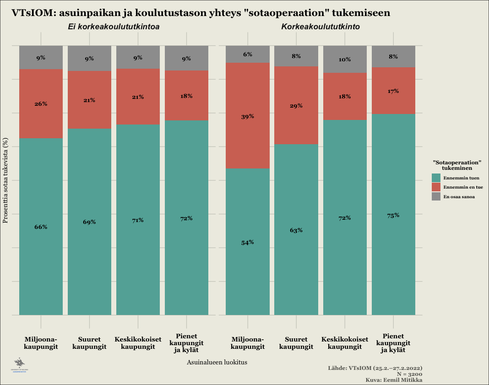
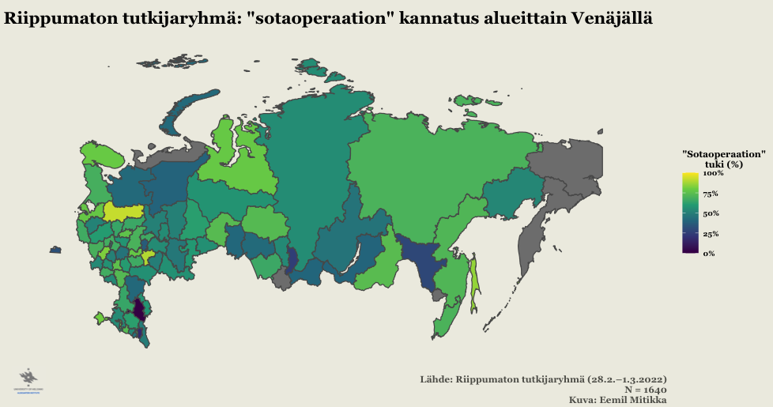
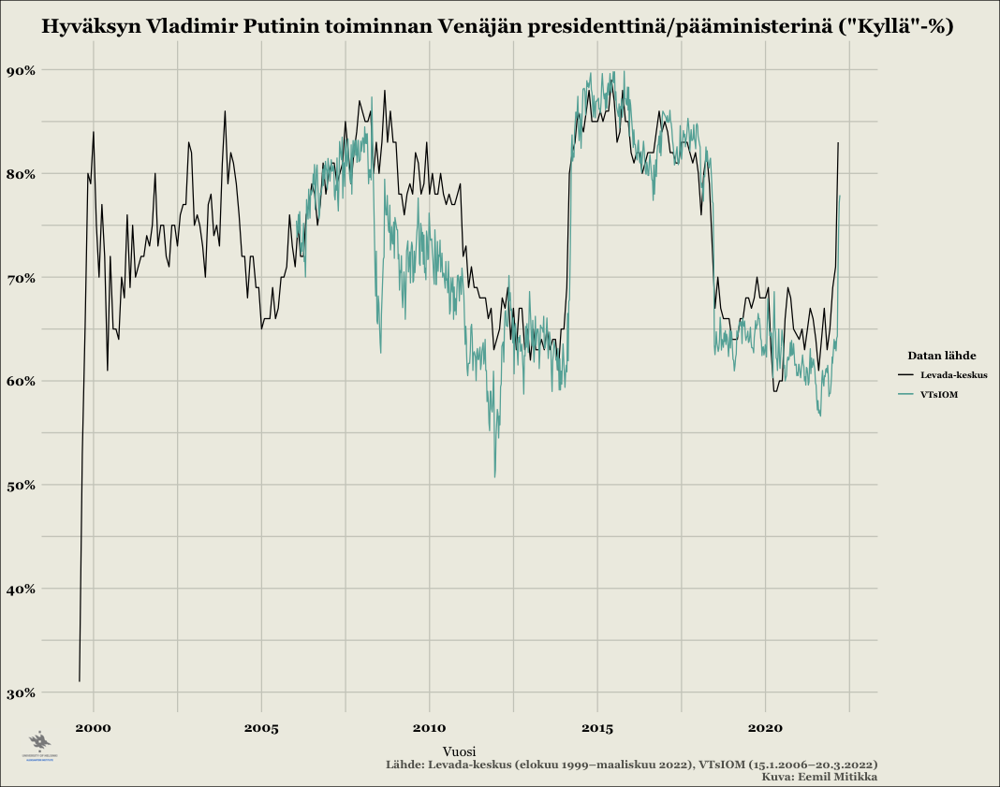

```{r setup, include=FALSE}
knitr::opts_chunk$set(echo = TRUE)
```

Venäjän aloitettua laajamittaisemman hyökkäyksen Ukrainaan -- sota alkoi jo vuonna 2014 -- on niin Suomessa kuin muuallakin pohdittu tavallisten venäläisten suhtautumista sotaan. Viimeksi viime viikon tiistaina 22.3.2022 Ylen A-studiossa aiheesta olivat keskustelemassa tutkija Kristiina Silvan Ulkopoliittisesta instituutista, suomenvenäläinen Oxana Kyllönen sekä MTV Uutisten Maailma & Kotimaa -toimituksen päällikö Mirja Kivimäki [@yle2022]. A-studiossa pohdittiin mm. miksi sotaa kannatetaan ja millaisia jakolinjoja sodan kannatuksella on venäläisen väestön keskuudessa.

Puran tässä blogikirjoituksessani sodan kannatusta kyselytutkimusdatan ja muutamien erilaisten taustamuuttujien valossa. Ensimmäinen data on peräisin valtion omistamalta mielipidetutkimuslaitos VTsIOMilta ja toinen on riippumattomalta venäläiseltä tutkijaryhmältä. Tekstin lopussa esittelen aineistot tarkemmin sekä pohdin lyhyesti näiden kyselyiden ja Venäjällä tehtävien kyselytutkimusten luotettavuutta ylipäänsä.

## Sodan yleiskannatus datan perusteella

Sodan -- tai "erikoissotaoperaation", kuten Venäjän mediassa asiasta puhutaan -- yleiskannatus on kummankin analysoimani aineiston perusteella hyvin samansuuntainen. Venäjän valtion omistaman tutkimuslaitoksen (tästä eteenpäin: VTsIOM) 25.2.--27.2.2022 teettämien kyselyiden [@vciom2022] perusteella kaksi kolmasosaa venäläisistä tukee Venäjän hyökkäystä Ukrainaan (Kuva 1). VTsIOM kysyy kantaa "sotaoperaation" kannatukseen kolmiportaisella asteikolla, jossa vastausvaihtoehdot ovat

1.  "Ennemmin tuen" (Скорее поддерживаю)

2.  "Ennemmin en tue" (Скорее не поддерживаю)

3.  "En osaa sanoa" (Затрудняюсь ответить)

Kuvassa 1 on nähtävillä tarkat prosentit vastaajaryhmittäin.


Riippumattoman tutkijaryhmän teettemä kysely [@riippumatontutkijaryhmä2022] maalaa hyvin samankaltaisen kuvan sodan yleiskannatuksesta. Ainestojen vertailtavuuden parantamiseksi olen kuvassa 2 visualisoinut sodan kannatusta samanlaisella kolmiluokkaisella asteikolla, kuin mitä VTsIOM käytti omissa kyselyissään. Kuten kuvasta käy ilmi, kolmiportaisella asteikolla mitattuna riippumattoman tutkijaryhmän luvut ovat käytännössä identtiset VTsIOMin lukuihin verrattuna.


Tässä kohtaa on tosin syytä mainita, että riippumattoman tutkijaryhmän kyselyssä "sotaoperaation" kannatusta tiedusteltiin alunperin kolmiluokkaisen asteikon sijaan viisiluokkaisella Likert-asteikolla (tai tarkalleen 7-portaisella asteikolla, jos "En osaa sanoa" ja "Kieltäytyy vastaamasta" lasketaan), joten ko. kysely tarjoaa tietyssä mielessä tarkemman kuvan sodan kannatuksesta VTsIOMin aineistoon verrattuna. Riippumattoman tutkijaryhmän kyselyssä "sotaoperaation" kannatuksen vastausvaihtoehdot olivat

1.  "Ehdottamasti tuen" (безусловно, поддерживаю)
2.  "Ennemmin tuen" (скорее поддерживаю)
3.  "Osittain tuen, osittain en tue" (в чем-то поддерживаю, в чем-то не поддерживаю)
4.  "Ennemmin en tue" (скорее не поддерживаю)
5.  "Ehdottamasti en tue" (безусловно, не поддерживаю)
6.  "En tiedä, en osaa sanoa" (не знает, затрудняется ответить)
7.  "Kieltäytyy vastaamasta" (Отказ от ответа)

Kuvassa 3 on nähtävissä "sotaoperaation" kokonaiskannatusluvut riippumattoman tutkijaryhmän kyselyn perusteella. Tälläkin asteikolla mitattuna Venäjän hyökkäystä tukee selvä ennemmistö vastaajista. Mielestäni huomionarvoista on kuitenkin se, että "Ehdottamasti en tue" on toiseksi suosituin vastauskategoria "Ehdottamasti tuen" jälkeen. Myös varsin suuri määrä vastaajista jättää vastaamatta kysymykseen: yhteensä 13% joko "Ei osaa sanoa" tai "Kieltäytyy vastaamasta" kysymykseen.


## Vanhemmat ikäluokat kannattavat sotaa selvästi nuoria enemmän

Aiemmin mainitussa Ylen A-studio jaksossa nostettiin esiin vanhempien ikäluokkien suurempi kannatus sodalle Venäjällä. Myös VTsIOMin ja riippumattoman tutkijaryhmän kyselyt vahvistavat tämän. Kuvissa 4 ja 5 on visualisoitu, kuinka sodan kannattatus nousee vastaajien iän myötä. Esimerkiksi VTsIOMin kyselyiden mukaan noin alle 20-vuotiaista yli puolet vastustaa sotaa, mutta jo hieman yli 25-vuotiaista valtaosa suhtautuu keskimäärin ennemmin myönteisesti kuin kielteisesti "sotaoperaatioon" (ks. punaisen ja vihreän viivan leikkauspiste).


Riippumattoman tutkijaryhmän aineisto vahvistaa myös korkeamman iän olevan yhteydessä korkeampaan "sotaoperaation" kannatukseen (kuva 5). Tosin tämän aineiston perusteella sotaa vastustavia vastaajia on alle 20-vuotiaissakin vain noin 40%, ja sotaa kannattavien määrä ylittää sotaa vastustavien määrän jo noin 25-vuotiaiden venäläisten kohdalla (punaisen ja vihreän viivan leikkauspiste). Huomionarvoista on toisaalta myös se, että epävarmojen vastaajien osuus on etenkin alle 30-vuotiaiden ikäisissä varsin suuri.


## Naiset kannattavat sotaa vähemmän kuin miehet

Sukupuoli näyttää myös tarkastelemieni ainestojen perusteella olevan yhteydessä sodan kannatukseen siten, että naiset kannattavat sotaa keskimäärin vähemmän kuin miehet. VTsIOMin kyselyiden perusteella naiset suhtautuvat miehiä kielteisemmin sotaan noin 62-vuotiaiksi asti, joista vanhemmissa ikäryhmissä miesten sodan vastustus on naisia suurempaa (kuva 6). Puolestaan etenkin noin 40--50-vuotiaat naiset vastustavat selvästi samanikäisiä miehiä voimakkaammin sotaa.


Myös riippumattoman tutkijaryhmän kyselyn mukaan sukupuoli vaikuttaa sodan kannatukseen vastaavalla tavalla (kuva 7). Esimerkiksi alle 18-vuotiasta naisista keskimäärin yli 45% vastustaa sotaa, kun taas vastaavan ikäisillä miehillä vastaava luku on alle 35%. Sukupuolten väliset erot sotaan suhtautumisessa ovat näkyviä etenkin noin 35-ikävuoteen asti siten, että naisten suhtautuminen sotaa kohtaan on selvästi kielteisempää. Mielenkiintoisesti myös tämän aineiston mukaan noin 62--ikävuodesta eteenpäin miesten suhtautuminen sotaan on naisia kielteisempää.


## Television katselu lisää sodan kannatusta

Kuten jo edellä mainitussa Ylen A-studiossakin mainittiin, television katselu on yksi selvästi sodan kannatusta lisäävä tekijä. Sekä VTsIOMIn että riippumattoman tutkijaryhmän kyselyissä sodan kannatus on suurempaa jokaisessa ikäluokassa niiden vastaajien osalta, jotka kuluttavat enemmän televisiota (kuvat 8 ja 9). Tämä ei ole kovinkaan yllättävää, sillä televisio on keskittynyt 2000-luvun alusta lähtien Venäjällä enenevissä määrin Kremliä lähellä olevien oligarkkien hallintaan [@zygar2016; @åslund2007]. Lisäksi Kremlin talutusnuorassa olevat kanavat suoltavat propagandaa ja valeuutisia kiihtyvään tahtiin [@aro2019; @pettersson2022].


Myös television katselun osalta sekä VTsIOMin että riippumattoman tutkijaryhmän tulokset ovat hyvin samansuuntaisia: television katselu lisää sodan kannatusta molempien kyselyiden perusteella. Riippumattoman tutkijaryhmän television kulutukseen liittyvä kysymys on kuitenkin tarkempi, koska siinä kysytään suoraan "*Mistä lähteistä saatte informaatiota Venäjän sotaoperaatiosta Ukrainan alueella?*" (Из каких источников вы получаете информацию о военной операции России на территории Украины, неважно, российские они, украинские или какие-то иные?), vastausvaihtoehtoja on useita ja vastaaja saa valita useamman kuin yhden vaihtoehdon. VTsIOM puolestaan tiedustelee ainoastaan "*Katsotteko televisiota vai ette, ja jos kyllä, niin kuinka usein?*" (Вы смотрите телевизор или нет? Если смотрите, то как часто?), joka ei suoraan mittaa sodasta saatavaa informaatiota -- vastaaja voi katsoa televiosta pelkästään tietynlaisia ohjelmia (esimerkiksi luontodokumentteja, urheilua, jne.). Joka tapauksessa television kulutus näyttää olevan voimakkaasti yhteydessä sodan kannatukseen.

## Internetin käytön yhteys sodan kannatukseen epäselvä

Venäjää seuraavien keskuudessa tuntuu olevan melko yleistä ajatella, että internetin käyttäjien keskuudessa kriittisyys Kremliä kohtaan on huomattavasti suurempaa televisiota pääasiassa tietolähteenä käyttäviin verrattuna. Näin ollen olisi loogista ajatella, että internetin käyttäjät suhtautuisivat myös huomattavasti kriittisemmin Venäjän "sotaoperaatioon" Ukrainassa. Tämä näkemys esitettiin myös edellä mainitussa Ylen A-studiossa.

Ymmärrän hyvin, mistä ajatus poliittisesti valveutuneimmista internetin käyttäjistä juontaa juurensa, sillä Kremlin sensuuriyrityksistä huolimatta internetistä on edelleen saatavilla Venäjällä paljon televisiota monipuolisemmin tietoa. Lisäksi Venäjän tunnetuin ja suosituin oppositiopolitiikko Aleksei Navalnyi tiimeineen käyttää taitavasti hyödyksi nimenomaan sosiaalisen median kanavia [@yleulkolinja2021]. Tämän ajatteluketjun looginen seuraus on, että internetin aktiivikäyttäjät suhtautuvat television katsojia todennäköisemmin kriittisesti Kremlin politiikkaan, mukaan lukien sotaan Ukrainassa.

Analysoimieni kyselyaineistojen perusteella tilanne ei kuitenkaan ole läheskään näin yksiselitteinen (kuvat 10 ja 11). Esimerkiksi VTsIOMin kyselydatan perusteella 18--30-vuotiasta päivittäin Internettiä käyttävistä peräti 41% kannattaa "sotaoperaatiota", kun vastaava luku samassa ikäluokassa ei-päivittäin internettiä käyttävien osalta on 18%. Muissa ikäluokissa nettiä päivittäin käyttävät tosin suhtautuvat nettiä ei-päivittäin käyttäviä ja televisiota päivittäin katsovia kriittisemmin sotaan, mutta ero ei ole etenkään vanhempien ikä luokkien kohdalla suuri. Selvyyden vuoksi mainittakoon, että kysymys internetin käytöstä on muotoiltu VTsIOMin kyselyssä näin: "*Käytöttekö internettiä? Jos käytettä, kuinka usein?*" (Вы пользуетесь интернетом? Если да, то как часто?).


Riippumattoman tutkijaryhmän kyselyn perusteella internetin käytön yhteys "sotaoperaation" tukeen on vielä epäselvempi (kuva 11). Ensinnäkin, erot sodan kannatuksessa internetistä tietonsa saavien ja muualta kuin internetistä tietonsa saavien välillä ovat melko pienet, etenkin nuoremmissa ikäluokissa. Lisäksi tämän aineiston perusteella "sotaoperaatiosta" netistä tietonsa saavien keskuudessa sodan kannatus on jopa suurempaa kuin muista tietolähteistä vastaavan tiedon saavilla.


Internetin käytön epäselvä yhteys sodan kannatukseen Venäjällä voi tuntua hämmentävältä. On kuitenkin syytä huomauttaa, että emme voi päätellä pelkästään *internetin käytön* perusteella seuraavia asioita:

A)  Millaisiin tarkoituksiin vastaaja käyttää internettiä (esim. VTsIOMin kysely)?
B)  Miten internetin käyttäjä käsittää ja ottaa vastaan saamansa informaation (esim. riippumattoman tutkijaryhmän kysely)?

Etenkin A-kohdan osalta täytyy pitää mielessä, että arvioiden mukaan yli 80% venäläisistä käyttää internettiä tänä päivänä [@roser2015], ja valtaosa internetin käyttäjistä -- venäläiset mukaan lukien -- käyttää sitä aivan muihin tarkoituksiin, kuin poliittisen informaation kuluttamiseen. Pelkistäen sanottuna suurin osa netin kulutuksesta koostuu paljon todennäköisemmin pornon, hassujen videoiden, elokuvien ja musiikin kulutuksesta sekä päivittäisistä toisten ihmisten kanssa käydyistä (usein epäpoliittisista) keskusteluista pikaviestipalveluissa, kuin poliittisten (oppositio)sisältöjen kulutuksesta.

Lisäksi B-kohdan osalta on syytä huomauttaa, että vaikka internetin käyttäjä (venäläinen) kuluttaisikin poliittisia sisältöjä -- kuten riippumattoman tutkijaryhmän kyselyssä tiedusteltiin -- ei tämä tarkoita automaattisesti sitä, että saatu informaatio edustaa poliittisen opposition (tässä tapauksessa sodan vastaista) linjaa. Toisin sanoen vaikka kyselyyn vastaaja saisikin informaation sodasta nettisivuilta, voivat nämä sivut olla myös lähellä Kremlin linjaa tai edustaa jopa Kremlin linjaa militaristisempia näkemyksiä. Lisäksi kuten esimerkiksi Evgeny Morozov on huomauttanut osuvasti, että autoritaaristen maiden johtajat omaksuvat oppositioaktivistien tapaan myös usein nopeasti uusien informaatio- ja kommunikaatioteknologioiden käytön, ja pyrkivät myös itse aktiivisesti vaikuttamaan internetissä olevan informaation sisältöön ja tämän kulutukseen [@morozov2011]. Lyhyesti tiivistäen: internetin käytön osalta tulisi tarkastella *määrän* sijaan myös *laatua*, jotta voisimme hahmottaa miten se vaikuttaa poliittisiin asenteisiin --- tässä tapauksessa Ukrainan sodan hyväksyntään Venäjällä.

## Alueelliset- ja koulutuserot sodan kannatuksessa

Kuvailevien tilastojen valossa korkeakoulutetut ja suuremmissa kaupungeissa asuvat kannattavat keskimäärin vähemmän sotaa, kuin väkiluvultaan pienemmillä asuinalueilla asuvat joilla ei ole korkeakoulututkintoa (kuvat 12 ja 13). Tosin asuinalueen pienentyessä myös koulutustason merkitys näyttää vähenevän, ja pienemmillä paikkakunnilla asuvat korkeakoulutetut saattavat näiden kyselyiden perusteella kannattaa jopa enemmän sotaa, kuin vastaavien asuinalueiden ei-korkeakoulutetut. Riippumattoman tutkijaryhmän kyselyn tuloksissa on tosin huomionarvoista tässä kohtaa, että korkeastikoulutettujen moskovalaisten ja pietarilaisten keskuudessa sodan vastustajia on lähes yhtä paljon kuin sen kannattajia. Saman datan mukaan korkeastikoulutetut kannattavat myös yleisesti ottaen vähemmän sotaa, vaikka erot eivät ole kovin suuria (ja alle 100,000 asukkaan paikkakunnilla korkeakoulutetut kannattavat jopa hieman enemmän sotaa).

Vaikka tilastollinen analyysini on tässä kohtaa melko pintapuolista ja kuvailevaa, näkisin silti, että asuinalueen koko on koulutustasoa merkittävämpi tekijä sodan kannatuksessa venäläisten keskuudessa aineiston perusteella. Tämä selittyy todennäköisesti sillä, että suuremmissa kaupungeissa -- niin Venäjällä kuin muuallakin -- on enemmän kansainvälisiä vaikutteita. Myös globalisaation myönteiset puolilla on tapana korostua nimenomaan suurkaupungeissa. Lisäksi aiemmassa tutkimuksessa pienemmillä paikkakunnilla asuvien venäläisten on havaittu olevan patrioottisempia [@mitikka2021] sekä suhtautuvan suurkaupungissa asuvia myönteisemmin asepalvelukseen [@svynarenko2016].




## Sodan kannatus alueittain

Tarkastelin VTsIOMin ja riippumattoman tutkijaryhmän sodan kannatusdataa karttavisualisointien avulla (kuva 14 ja 15). Pelkällä sodan kannatuksen alueellisella vertailulla en kuitenkaan ainakaan itse pystynyt vetämään kovin pitkälle meneviä johtopäätöksiä, sillä esimerksiksi VTsIOMin kyselyssä raportoidaan vastaajan asuinalue ainoastaan federaatiopiirin tasolla, joka on auttamatta karkea mittari (kuva 14).


Riippumattoman tutkijaryhmän kyselyssä asuinpaikkaa on puolestaan kysytty huomattavasti tarkemmin, mutta tämänkin datan osalta on otoskoko jäi useissa kaupungeissa melko pieneksi. Lisäksi riippumattoman tutkijaryhmän kyselystä puuttui kokonaan joitakin merkittäviä kaupunkeja (esim. Kazan) ja paikkakuntien otostarkkuus vaihtelee huomattavasti -- joissain tapauksissa oli kysytty kaupunki- tai jopa kylätasolla, toisinaan vain alueellisella (ven. *oblast*) tasolla (kuva 15).



Toisaalta VTsIOMin ja riippumattoman tutkijaryhmän aineistoista löytyi tässä kohtaa myös mielenkiintoisia yhtäläisyyksiä. Esimerkiksi Komin tasavallassa on molempien aineistojen mukaan suhteellisen matala sodan kannatus, mikä näkyy tummempana värityksenä sekä riippumattoman tutkijaryhmän alueellisen tason karttavisualisoinnissa, että VTsIOMin federaatiopiiritason (luoteinen federaatiopiiri) datassa.

## Voiko venäläisiin kyselyihin luottaa? Venäläisten kyselyiden kritiikki

Kyselytutkimuksista puhuttaessa herää luonnollisesti kysymys, kuinka luotettavina niiden tuloksia voidaan pitää. Tämä kysymys on erityisten relevantti Venäjän kaltaisissa autoritaarisissa ja korruptoituneissa yhteiskunnissa tehtyjen kyselyjen kohdalla, jossa sanan- ja mielipiteen vapaus on huomattavasti rajallisempi verrattuna demokraattisiin yhteiskuntiin. Vaikka venäläisten kyselytutkimusten luotettavuuden perkaaminen vaatisi oman artikkelinsa, käyn kuitenkin seuraavaksi läpi lyhyesti venäläisiin kyselyitä kritisoivien tyypillisimpiä argumentteja näitä kommentoiden.

#### *"Venäläiset kyselytutkimuslaitokset vääristelevät kyselyiden tuloksia tai keksivät niitä päästään"*

Yksi yleisesti esitetty argumentti on, että venäläiset kyselytilastojen tuottajat keksivät kyselyiden tulokset yksinkertaisesti päästään [@morris2022]. Syitä tälle voivat olla esimerkiksi se, että venäläiset ovat haluttomia vastaamaan kyselyihin [@kac2022; @napreenko2017], jolloin puuttuvia tuloksia pitäisi paikkailla esimerkiksi keksimällä niitä. Toinen mahdollinen syy tulosten keksimiselle tai vääristelylle voi olla tarve saada kyselyn tilaajan kannalta mieluisia tuloksia. Tämä kysymys on aiheellinen erityisesti valtioon sidoksissa olevien kyselytutkimuslaitosten, kuten VTsIOMin ja FOMin (ven. Фонд Общественное Мнение / ФОМ) kohdalla: esimerkiksi VTsIOMin nykyinen johtaja Valeri Fedorov on jo vuosia sitten sanonut täysin avoimesti, että VTsIOM ei käytännössä julkaise mitään tuloksia ilman valtapuolue Yhtenäisen Venäjän lupaa [@makeev2013].

Mielestäni "keksityt luvut" -argumentin uskottavuutta syö kuitenkin se, että myös valtiosta riippumattomien kyselytutkimuslaitosten kyselyt maalaavat usein hyvin samankaltaisen kuvan erilaisista yhteiskunnallisista asenteista Venäjällä. Kuvassa 16 olen visualisoinut venäläisten tyytyväisyyttä Vladimir Putinin toimintaan presidenttinä ja pääministerinä.[^1] Kuten kuvasta näkyy, valtiosta riippumattoman -- ja etenkin lännessä arvostetun -- Levada-keskuksen kyselyissä Putinin suosio on hyvin lähellä Kremliin kytköksissä olevan VTsIOMin lukuja. Itseasiassa monin paikoin Levadan kyselyt jopa antavat Putinin kannalta imartelevamman kuvan hänen suosiostaan, kuin mitä VTsIOMin vastaavat luvut.

[^1]: Huom. Levada-keskus tiedustelee tyytyväisyyttä nimenomaan Putiniin ("Вы в целом одобряете или не одобряете деятельность Владимира Путина на посту президента (премьер-министра) России?"), kun taas VTsIOMin kysymyksenasettelussa kysytään tyytyväisyyttä presidenttiin instituutiona ("Вы в целом одобряете или не одобряете деятельность: Президента России?").



Mielestäni tämän vuoksi "keksityt luvut" -argumentti on hiukan ontto, sillä tällä logiikalla myös Levada-keskuksen ja muiden valtiosta itsenäisten -- ja usein Venäjän oppositiota edustavien -- kyselytutkimusten tulokset ikään kuin "nollataan", ja leimataan kategorisesti epäammattimaisesti tehdyiksi ja epäluotettaviksi. Samalla on hyvä muistaa, että Venäjä on ollut jo 1990-luvulta lähtien mukana monissa isoissa kansainvälisissä kyselytutkimushankkeissa, kuten Maailman arvotutkimuksessa (World Values Survey) ja Eurooppalaisessa sosiaalitutkimuksessa (European Social Survey). Lisäksi nähdäkseni myös Venäjän vallanpitäjien intresseissä on saada mahdollisimman luotettavaa tietoa valtansa legitimiteetistä, sillä mikään valtajärjestelmä ei pysy pystyssä ilman väestön enemmistön tukea tai ainakin hiljaista hyväksyntää -- eivät edes autoritaariset hallinnot [@rose2011]. Tämän takia Kremlin ei ainakaan tietoisesti kannattaisi painostaa kyselytutkimuksia tekeviä tahoja kaunistelemaan numeroita.

#### *"Venäläiset vastaavat epärehellisesti kyselyihin"*

Toinen hyvin yleisesti esitetty argumentti venäläisen kyselydatan (ja ylipäänsä kyselytutkimusten) luotettavuutta vastaan on niin sanottu "sosiaalisen hyväksyttävyyden vinouma" (eng. *social desirability bias*) tai "mieltymysten vääristely" (eng. *preference falsification*). Näiden teorioiden mukaan etenkin Venäjän kaltaisissa autoritaarisissa maissa ihmisillä on tapana antaa kyselytutkimuksissa vain yleisesti hyväksyksyttyjä ja vallitsevien sosiaalisten normien mukaisia vastauksia [@alyukov2022; @rogov2017; @kuran1997]. Tämän vuoksi etenkään autoritaarisissa maissa tehdyt kyselytutkimukset eivät kuvasta kansalaisten "todellisia" asenteita, vaan kertovat enneminkin näissä yhteiskunnissa vallitsevista sosiaalisista normeista.

Todellisten mielipiteiden kertomatta jättäminen kyselytutkimuksissa on tietenkin täysin mahdollista. Ainakin kaksi tekijää kuitenkin puhuu sen puolesta, että venäläiset vastaavat kyselyihin kohtalaisen rehellisesti: 1) aiempi näyttö mielipiteiden vaihtelusta sosiaalisesti arkaluontoisten kysymysten osalta Venäjällä, ja 2) aiempi kokeellinen tutkimus aiheeseen liittyen.

Aloitetaan ensimmäisestä tekijästä, eli mielipiteiden vaihtelusta myös sosiaalisesti arkaluontoisten kysymysten kohdalla. Jokainen Venäjää vähänkin seuraava lienee samaa mieltä siitä, että Vladimir Putinin on Venäjällä poliittisesti merkittävä henkilö. Näin ollen voitaneen olettaa myös, että kysyttäessä venäläiseltä "hyväksytkö Vladimir Putinin toiminnan?", on hyväksyvä kanta vallitseva sosiaalinen normi. Jos taas venäläiset eivät uskaltaisi vastata kyselyihin ollenkaan rehellisesti, niin tämän logiikan mukaan Putinin kannatuksen pitäisi olla jatkuvasti jossain 80--90% tienoilla. Kuten kuvasta 16 kuitenkin käy ilmi, Putinin kannatus vaihdellut huomattavasti hänen poliittisen uransa aikana, ja ainostaan Krimin valtausta seuranneen "Krim-euforian" aikana hänen kannatuksensa oli pidemmän aikaa 80% paremmalla puolella. Putinin kannatus on myös sukeltanut lähelle 60% (mikä on Venäjällä suhteessa alhainen luku) tai jopa tämän alle 2011--2013 massaprotestien aikaan ja ajoittain myös viime vuosina. Nähdäkseni tällaista vaihtelua tuskin olisi, jos venäläiset peittäisivät täysin todelliset mielipiteensä kyselytutkimuksissa.

Lisäksi kohtalaisen tuoreessa kokeellisessa tutkimuksessa tutkittiin nimenomaan sosiaalisten normien mukaista vastaamista mielipidetutkimuksissa Venäjällä [@frye2017]. Tässä tutkimuksessa käytettiin nimenomaan Putinin kannatusta sosiaalisesti arkaluontoisena kysymyksenä, eivätkä tutkijat havainneet merkkitävää vinoumaa venäläisten vastauksissa tähän kysymykseen.

#### *"Huonot asteikot"*

Venäläisten sodan kannatusta mittaavia kyselyitä on kritisoitu myös liian karkeasta mitta-asteikon käytöstä: jos vastausvaihtoehdot kysymykseen "*kannatatko sotaa?*" ovat vain "Kyllä" ja "Ei" [@alyukov2022b] (ja "En osaa sanoa"), vastaajat ovat pakotettuja tekemään karkean valinnan sodan kannatuksen ja sodan vastustamisen välillä. Näin ollen mahdollisesti ristiriitaisia tunteita vastaajassa herättävä kysymys pelkistetään ja yksinkertaistetaan helposti tulkittavaan muotoon, jolloin esimerkiksi sotaa "ehdottomasti kannattavat" ja "ennemmin kannattavat" sekä sotaa "ehdottomasti vastustavat" ja "ennemmin vastustavat" niputetaan karkeasti yhteen. Lisäksi "Kyllä-Ei" -asteikosta puuttuu neutraalia vaihtoehtoa kuvaava aritmeettinen keskipiste, jolloin vastaajien voidaan spekuloida valitsevan harvemmin "En tiedä"-vastauksen, kuin esimerkiksi viisiportaisella Likert-asteikolla ("Täysin samaa mieltä" ... "Täysin eri mieltä") mitattuna.

Venäjällä tehdyissä sodan kannatuskyselyissä osassa käytetään kaksiportaista "Kyllä-Ei"-asteikkoa, ja osassa hienojakoisempaa Likert-asteikkoa. Esimerkiksi Kremliin kytköksissä olevat tutkimuslaitokset VTsIOM ja FOM (ven. Фонд Общественное Мнение, ФОМ) ja osa opposition teettemistä kyselytutkimuksista [@dorussianswantwar2022] käyttää nimenomaan "Kyllä-Ei"-asteikkoa. Kuitenkin esimerkiksi tässä blogiteksitssä esitelyssä riippumattoman tutkijaryhmän kyselyssä käytetään tarkempaa Likert-asteikkoa, ja samalla myös vastausten jakauma tarkentuu (ks. kuva 3). Samalla kuitenkin yleiskuva pysyy samana kyselystä riippumatta: vaikka tarkemman asteikon kyselyissä sodan kannatus tai hyväksyntä on vähäisempää, hyväksyy valtaosa vastaajista kuitenkin Venäjän hyökkäyksen (kuvat 2 ja 3). Lisäksi kuvassa 17 olen visualisoinut toisen valtiosta riippumattoman kyselytutkimuslaitos Russian Fieldin [@russianfield2022a] kyselyn tuloksia sodan kannatuksesta. Vaikka tässä kyselyssä käytettiin tarkempaa viisiportaista asteikkoa ja kysyttiin "sotaoperaation" sijaan "sotatoimista" ("Поддерживаете ли вы военные действия со стороны России на территории Украины?"), kannattaa valtaosa (noin 59%) vastaajista yhä sotaa noin kolmasosan (34%) vastustaessa sitä. Vaikka dataa voisi analysoida tarkemminkin, ovat yleisluvut sodan kannatuksesta jälleen kerran hyvin samansuuntaisia muiden kyselyiden kanssa.


#### *"Kyselyihin valikoituvat vain tietynlaiset ihmiset, vastausinto on matala"*

Kohtalaisen usein (venäläisiä) kyselytutkimuksia kritisoidaan myös vastaajien valikoitumisesta sekä yhä matalammasta osallistumisprosentista kyselyihin [@alyukov2022a; @mostovshchikov2022]. Molemmat tekijät syövät yleisesti kyselyiden tulosten uskottavuutta, sillä vain tietynlaisten ihmisten osallistuessa kyselyihin voidaan oikeutusti kysyä, keitä kyselyiden osallistujat ja yhtäältä kyselyistä kieltäytyvät ihmiset edustavat? Jos vain 10--15% potentiaalisista vastaajista lopulta vastaa kyselyyn, edustaako kysely tällöin enemmistön mielipiteitä?

Jälleen kerran on vaikea antaa yksiselitteistä vastausta ihmisten motiiveilla osallistua tai olla osallistumatta kyselytutkimuksiin. Etenkin venäläisiä kyselytutkimuksia kritisoivan venäläissosiologi Grigori Judinin mukaan vastausprosentit ovat Venäjällä olleet pitkään hyvin matalia [@mostovshchikov2022; @napreenko2017]. Lisäksi tilanteen on todennäköisesti pahentunut entisestään sotapropagan jyllätessä, ja on arvioitu, että tällä hetkellä kyselyiden vastausprosentti on Venäjällä vain 5% luokkaa [@kac2022; @morris2022a].

Tässä blogitekstissä käsittelevien kyselytutkimusten aineistoista on kuitenkin hankalaa päätellä, keitä sotaan liittyviin kyselyihin osallistujat edustavat. VTsIOM ei esimerkiksi raportoi vastausprosenttia, vaan ainoastaan kyselyyn vastanneet tahot. Toisin sanoen, vaikka otanta on yhteensä 3200, ei kerrota, kuinka monelle ihmiselle oli soitettava jotta saatiin 3200 vastaajaa kyselyyn. Riippumattoman tutkijaryhmän kyselyn osalta tämä luku oli kuitenkin raportoitu: tämän kyselyn tekijöiden oli soitettava 27751 ihmisille, jotta 1640 vastaajaa saatiin täyteen. Näin ollen tämän kyselyn vastausprosentti oli noin 6% luokkaa, mikä kieltämättä kielii laajasta haluttomuudesta osallistua sotaan liittyviin kyselyihin.

Mielestäni matala osallistumisprosentti ja mahdollinen tietynlaisten ihmisten valikoituminen kyselyihin ovatkin oletettua tulosten suoranaista vääristelyä, epärehellistä vastaamista tai epätarkkoja asteikkoja vakavampia ongelmia sotaan liittyvien venäläisten kyselyiden luotettavuutta arvioitaessa. Ongelmaa kärjistää entisestään myös se, että esimerkiksi VTsIOMin ja Levada-keskuksen kyselytutkimusten dokumentaatio on usein varsin suppeaa. Usein nämä organisaatiot raportoivat esimerkiksi vain kuvailevat kokonaistilastot (esim. "näin monta prosenttia venäläisistä hyväksyy Putinin toiminnan") ja mahdollisesti samat tilastot muutaman valikoidun taustamuuttujan valossa (esim. ikä, sukupuoli), mutta eivät yleensä tarjoa kyselyn raakadataa taustamuuttujineen organisaationsa ulkopuolisille ihmisille analysoitavaksi.

## Lopuksi

Vaikka ottaisimme huomioon edellä mainitun pohdinnan, emme tietenkään voi varmuudella sanoa, kuinka luotettavia tässä esitellyt kyselyt ovat. On kuitenkin syytä muistaa, että 100% luotettavaa tutkimusaineistoa ei ole olemassakaan. Yhteiskuntatieteellisessä tutkimuksessa ei voi myöskään tehdä samanlaisia kontrolloituja empiiriisiä toistokokeita, jotka ovat joissain matemaattis-luonnontieteellisissä tutkimuksissa mahdollisia. Monet kyselytutkimuksissa olevat epävarmuustekijät (aineiston vääristely ja luotettavuus, epärehelliset vastaukset ja/tai itsesensuuri, tietynlaisten ihmisten valikoituminen, jne.) ovat kuitenkin läsnä myös muussa sosiaalitieteellisessä tutkimuksessa. Emme esimerkiksi voi tietää myöskään laadullisten pienemmän otannan haastattelututkimusten osalta, vastaavatko haastattelut rehellisesti, mikä on heidän motiivinsa osallistua tutkimukseen, ja niin edelleen. Tämä ei silti tarkoita sitä, että laadullisempaa yhteiskuntatieteellistä ei tarvita tai sitä ei kannattaisi tehdä. Ja jos kyselytutkimusten kärkkäimpien kriitikoiden kriteerejä sovellettaisiin muuhun sosiaalitieteelliseen tai Venäjä-tutkimukseen, ei tällaista tutkimusta olisi ylipäänsä mahdollista tehdä. Mielestäni sekä määrällisellä että laadullisella yhteiskuntatieteellisellä- ja Venäjä-tutkimuksella on kuitenkin paikkansa.

Tämä ei tarkoita sitä, että venäläisiin kyselytutkimuksiin voi suhtautua kritiikittä ja olettaa tulosten kuvastavan täydellisesti venäläisten (enemmistön) mielipiteitä. Kuten sanottua, täydellistä tutkimusaineistoa ei ole olemassa, jokaisessa aineistossa on omat vahvuutensa ja heikkoutensa, ja kaikkiin tutkimusaineistoihin on suhtauduttava asianmukaisella kriittisyydellä. Yhtäältä emme kuitenkaan voi myöskään suoralta kädeltä sanoa, että kyselytutkimukset venäläisten suhtautumisesta meneillä olevasta Ukrainan sodasta olisivat täysin perättömiä nollatutkimuksia. Ja vaikka data olisikin epäluotettavaa, voi siitä silti tehdä mielenkiintoisia havaintoja. Sen vuoksi meidän olisi mielestäni hyväksyttävä myös se mahdollisuus -- niin masentavaa kuin se onkin -- että valtaosa Venäjän kansasta jos nyt ei suoraan tue, niin ainakin antaa hiljaisen hyväksyntänsä Venäjän hyökkäykselle Ukrainaan. Samalla olisi hyvä pohtia, millaisia vaikutuksia tällä on Ukrainan, Suomen, Euroopan ja Venäjän tulevaisuudelle.

## Tässä käytetystä datasta ja niiden tuottajista

Venäläisiä kyselyaineistoja -- ja ylipäänsä kyselyaineistoja -- analysoitaessa ja tulkittaessa on hyvä tiedostaa kuka kyselystä on vastannut, sillä kyselyn tekijällä voi olla oma poliittinen agendansa. Lisäksi kyselyn suorittavalla organisaatiolla on aina tietty asema kyselyyn osallistujiin nähden. Tämän vuoksi esittelen lyhyesti lopuksi datan tuottaneet tahot.

#### VTsIOM

Kuten blogitekstin alussa mainitsin, VTsIOM (ven. Всероссийский центр изучения общественного мнения) on Venäjän valtion käytännössä omistama laitos. Tämän vuoksi erityisesti VTsIOMin lukuihin on suhtauduttava tietyllä varauksella: esimerkiksi kyseisen laitoksen nykyinen johtaja Valeri Fedorov on jo vuosia sitten sanonut täysin avoimesti, että VTsIOM ei käytännössä julkaise mitään tuloksia ilman valtapuolue Yhtenäisen Venäjän lupaa [@makeev2013]. Tämän vuoksi on syytä epäillä, että VTsIOM julkaisisi Kremlin kannalta epämieluisia kyselytuloksia. VTsIOMin rooliin ja lukujen kaunisteluun on kiinnitetty jo aiemmin huomiota, myös suomalaisessa mediassa [@nurminen2019].

VTsIOM perustettiin perustettiin Neuvostoliiton loppuaikoina vuonna 1987, ja sitä pidettiin pitkään Venäjän luotettavimpana kyselytutkimuslaitoksena. Vuonna 2003 VTsIOM siirtyi kuitenkin Kremlin alaisuuteen, jonka seurauksena silloinen laitoksen johtaja Juri Levada ja suurin osa laitoksen silloisista työntekijöistä jätti VTsIOMin ja perusti valtiosta riippumattoman -- ja lännestä rahoitetun sekä myöhemmin ulkomaiseksi agentiksi leimatun -- Levada-keskuksen. Levadan tutkijaryhmä korvattiin Putinin sisäpiiriin kuuluvan Vladislav Surkovin valitsemilla sosiologeilla [@zygar2016a].

Toisaalta VTsIOMin lukujen oikeansuuntaisuutta ja uskottavuutta lisää se, että myös tässä blogitekstissä käytetyn riippumattoman tutkijaryhmän kyselytulokset maalaavat melko samankaltaisen kuvan sodan kannatuksesta venäläisten keskuudessa monilla osa-alueilla. Kuitenkin tarkemmalla asteikolla mitattuna sotaa ennemmin kannattavien osuus putosi jo lähemmäs 10%, ja vastaavasti kannastaan epävarmojen osuus kasvoi 10%.

#### Riippumaton tutkijaryhmä

Löysin riippumattoman tutkijaryhmän datan alunperin riippumattoman venäjänkielisen uutissivusto Meduzan artikkelin kautta, jossa Exeterin yliopistossa työskentelevä tutkija Alexey Bessudnov analysoi VTsIOMin kyselydataa sodan kannatuksesta Venäjällä [@bessudnov2022]. Bessudnovin artikkelissa oli linkki sivustolle, josta "riippumattoman tutkijaryhmän" datan sekä tähän liittyvät kyselylomakkeet, kyselyn kuvaukset yms. pystyi lataamaan [^2]. Suhtauduin aluksi varauksella koko kyselyyn, koska en löytänyt mistään muualta "viralliselta" sivustolta tietoa tästä kyselystä. Kysely vaikutti kuitenkin ammattimaisesti tehdyltä, ja ajattelin myös, että ehkä Venäjällä kiristyneen sotasensuurin ja kansalaisyhteiskunnan sorron takia kyseinen ryhmä ei halunnut tehdä virallisempaa julkaisua kyselystään. Ajattelin myös, että VTsIOMin aineistoja analysoinut Bessudnov todennäköisesti joko tiesi ketkä kyselyn olivat tuottaneet, tai ainakin hänellä oli jonkinlainen käsitys asiasta. Myöhemmin huomasin myös, että venäläinen oppositiopoliitikko Vladimir Milov oli twiitannut kyselyyn liittyen [@milov2022]. Tämäkin puhuisi osaltaan sen puolesta, että kysely on todella Kremlistä riippumattomien tutkijoiden tekemä.

[^2]: Riippumaton tutkijryhmä kuvaili kyselyn tekijöitä näin: "Tutkimus on tehty riippumattoman sosiologi- ja IT-asiantuntijaryhmän aloitteesta. Projekti toi yhteen riippumattomia tutkijoita ja tutkimuslaitoksia eri Venäjän alueilta - Moskovasta, Samarasta (FSI, ven. Фондасоциальных исследований), Voronežista (Kvalitas, venäläinen yksityinen mielipidetutkimuslaitos), Tšeboksarysta (Maksima, venäläinen yksityinen mielipidetutkimuslaitos), Kazanista ja muualta" (Исследование проведено по инициативе группы независимых социологов и IT-специалистов. Проект объединил независимых исследователей и исследовательских компаний в различных регионах -- Москвы, Самары (ФСИ), Воронежа (Квалитас), Чебоксар (Максима), Казани и других).

### Lähteet

Teksti olisi ollut mahdollista lähteistää tiukemminkin, mutta halusin pitää viitteiden määrän kohtuullisena. Jos lähteestä oli tarjolla hyvä suomen- tai englanninkielinen versio (esim. Mihail Zygarin kirja), käytin
