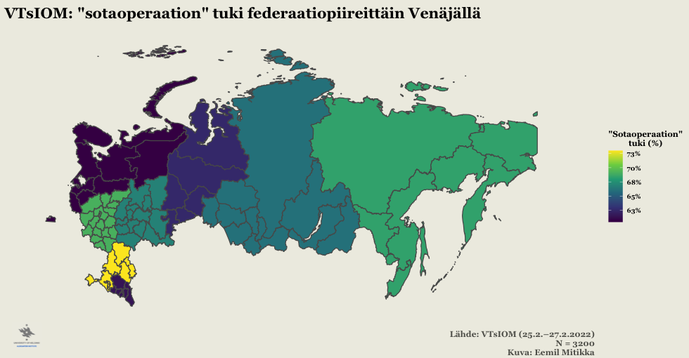

```{r setup, include=FALSE}
knitr::opts_chunk$set(echo = TRUE)
```

Venäjän aloitettua laajamittaisemman hyökkäyksen Ukrainaan -- sota alkoi jo vuonna 2014 -- on niin Suomessa kuin muuallakin pohdittu tavallisten venäläisten suhtautumista sotaan. Viimeksi viime viikon tiistaina 22.3.2022 Ylen A-studiossa aiheesta olivat keskustelemassa tutkija Kristiina Silvan Ulkopoliittisesta instituutista, suomenvenäläinen Oxana Kyllönen sekä MTV Uutisten Maailma & Kotimaa -toimituksen päällikö Mirja Kivimäki [@yle2022]. A-studiossa pohdittiin mm. miksi sotaa kannatetaan ja millaisia jakolinjoja sodan kannatuksella on venäläisen väestön keskuudessa.

Puran tässä blogikirjoituksessani sodan kannatusta kyselytutkimusdatan ja muutamien erilaisten taustamuuttujien valossa. Ensimmäinen data on peräisin valtion omistamalta mielipidetutkimuslaitos VTsIOMilta (ven. Всероссийский центр изучения общественного мнения) ja toinen on riippumattomalta venäläiseltä tutkijaryhmältä. Tekstin lopussa esittelen aineistot tarkemmin sekä pohdin lyhyesti näiden kyselyiden ja Venäjällä tehtävien kyselytutkimusten luotettavuutta ylipäänsä.

## Sodan yleiskannatus datan perusteella

Sodan -- tai "erikoissotaoperaation", kuten Venäjän mediassa asiasta puhutaan -- yleiskannatus on kummankin analysoimani aineiston perusteella hyvin samansuuntainen. Venäjän valtion omistaman tutkimuslaitoksen (tästä eteenpäin: VTsIOM) 25.2.--27.2.2022 teettämien kyselyiden [@vciom2022] perusteella kaksi kolmasosaa venäläisistä tukee Venäjän hyökkäystä Ukrainaan (Kuva 1). VTsIOM kysyy kantaa "sotaoperaation" kannatukseen kolmiportaisella asteikolla, jossa vastausvaihtoehdot ovat

1.  "Ennemmin tuen" (Скорее поддерживаю)

2.  "Ennemmin en tue" (Скорее не поддерживаю)

3.  "En osaa sanoa" (Затрудняюсь ответить)

Kuvassa 1 on nähtävillä tarkat prosentit vastaajaryhmittäin.


Riippumattoman tutkijaryhmän teettemä kysely [@riippumatontutkijaryhmä2022] maalaa hyvin samankaltaisen kuvan sodan yleiskannatuksesta. Ainestojen vertailtavuuden parantamiseksi olen kuvassa 2 visualisoinut sodan kannatusta samanlaisella kolmiluokkaisella asteikolla, kuin mitä VTsIOM käytti omissa kyselyissään. Kuten kuvasta käy ilmi, kolmiportaisella asteikolla mitattuna riippumattoman tutkijaryhmän luvut ovat käytännössä identtiset VTsIOMin lukuihin verrattuna.


Tässä kohtaa on tosin syytä mainita, että riippumattoman tutkijaryhmän kyselyssä "sotaoperaation" kannatusta tiedusteltiin alunperin kolmiluokkaisen asteikon sijaan viisiluokkaisella Likert-asteikolla (tai tarkalleen 7-portaisella asteikolla, jos "En osaa sanoa" ja "Kieltäytyy vastaamasta" lasketaan), joten ko. kysely tarjoaa tietyssä mielessä tarkemman kuvan sodan kannatuksesta VTsIOMin aineistoon verrattuna. Riippumattoman tutkijaryhmän kyselyssä "sotaoperaation" kannatuksen vastausvaihtoehdot olivat

1.  "Ehdottamasti tuen" (безусловно, поддерживаю)
2.  "Ennemmin tuen" (скорее поддерживаю)
3.  "Osittain tuen, osittain en tue" (в чем-то поддерживаю, в чем-то не поддерживаю)
4.  "Ennemmin en tue" (скорее не поддерживаю)
5.  "Ehdottamasti en tue" (безусловно, не поддерживаю)
6.  "En tiedä, en osaa sanoa" (не знает, затрудняется ответить)
7.  "Kieltäytyy vastaamasta" (Отказ от ответа)

Kuvassa 3 on nähtävissä "sotaoperaation" kokonaiskannatusluvut riippumattoman tutkijaryhmän kyselyn perusteella. Tälläkin asteikolla mitattuna Venäjän hyökkäystä tukee selvä ennemmistö vastaajista. Mielestäni huomionarvoista on kuitenkin se, että "Ehdottamasti en tue" on toiseksi suosituin vastauskategoria "Ehdottamasti tuen" jälkeen. Myös varsin suuri määrä vastaajista jättää vastaamatta kysymykseen: yhteensä 13% joko "Ei osaa sanoa" tai "Kieltäytyy vastaamasta" kysymykseen.


## Vanhemmat ikäluokat kannattavat sotaa selvästi nuoria enemmän

Aiemmin mainitussa Ylen A-studio jaksossa nostettiin esiin vanhempien ikäluokkien suurempi kannatus sodalle Venäjällä. Myös VTsIOMin ja riippumattoman tutkijaryhmän kyselyt vahvistavat tämän. Kuvissa 4 ja 5 on visualisoitu, kuinka sodan kannattatus nousee vastaajien iän myötä. Esimerkiksi VTsIOMin kyselyiden mukaan noin alle 20-vuotiaista yli puolet vastustaa sotaa, mutta jo hieman yli 25-vuotiaista valtaosa suhtautuu keskimäärin ennemmin myönteisesti kuin kielteisesti "sotaoperaatioon" (ks. punaisen ja vihreän viivan leikkauspiste).


Riippumattoman tutkijaryhmän aineisto vahvistaa myös korkeamman iän olevan yhteydessä korkeampaan "sotaoperaation" kannatukseen (kuva 5). Tosin tämän aineiston perusteella sotaa vastustavia vastaajia on alle 20-vuotiaissakin vain noin 40%, ja sotaa kannattavien määrä ylittää sotaa vastustavien määrän jo noin 25-vuotiaiden venäläisten kohdalla (punaisen ja vihreän viivan leikkauspiste). Huomionarvoista on toisaalta myös se, että epävarmojen vastaajien osuus on etenkin alle 30-vuotiaiden ikäisissä varsin suuri.


## Naiset kannattavat sotaa vähemmän kuin miehet

Sukupuoli näyttää myös tarkastelemieni ainestojen perusteella olevan yhteydessä sodan kannatukseen siten, että naiset kannattavat sotaa keskimäärin vähemmän kuin miehet. VTsIOMin kyselyiden perusteella naiset suhtautuvat miehiä kielteisemmin sotaan noin 62-vuotiaiksi asti, joista vanhemmissa ikäryhmissä miesten sodan vastustus on naisia suurempaa (kuva 6). Puolestaan etenkin noin 40--50-vuotiaat naiset vastustavat selvästi samanikäisiä miehiä voimakkaammin sotaa.


Myös riippumattoman tutkijaryhmän kyselyn mukaan sukupuoli vaikuttaa sodan kannatukseen vastaavalla tavalla (kuva 7). Esimerkiksi alle 18-vuotiasta naisista keskimäärin yli 45% vastustaa sotaa, kun taas vastaavan ikäisillä miehillä vastaava luku on alle 35%. Sukupuolten väliset erot sotaan suhtautumisessa ovat näkyviä etenkin noin 35-ikävuoteen asti siten, että naisten suhtautuminen sotaa kohtaan on selvästi kielteisempää. Mielenkiintoisesti myös tämän aineiston mukaan noin 62--ikävuodesta eteenpäin miesten suhtautuminen sotaan on naisia kielteisempää.


## Television katselu lisää sodan kannatusta

Kuten jo edellä mainitussa Ylen A-studiossakin mainittiin, television katselu on yksi selvästi sodan kannatusta lisäävä tekijä. Sekä VTsIOMIn että riippumattoman tutkijaryhmän kyselyissä sodan kannatus on suurempaa jokaisessa ikäluokassa niiden vastaajien osalta, jotka kuluttavat enemmän televisiota (kuvat 8 ja 9). Tämä ei ole kovinkaan yllättävää, sillä televisio on keskittynyt 2000-luvun alusta lähtien Venäjällä enenevissä määrin Kremliä lähellä olevien oligarkkien hallintaan [@zygar2016; @åslund2007]. Lisäksi Kremlin talutusnuorassa olevat kanavat suoltavat propagandaa ja valeuutisia kiihtyvään tahtiin [@aro2019; @pettersson2022].


Myös television katselun osalta sekä VTsIOMin että riippumattoman tutkijaryhmän tulokset ovat hyvin samansuuntaisia: television katselu lisää sodan kannatusta molempien kyselyiden perusteella. Riippumattoman tutkijaryhmän television kulutukseen liittyvä kysymys on kuitenkin tarkempi, koska siinä kysytään suoraan "*Mistä lähteistä saatte informaatiota Venäjän sotaoperaatiosta Ukrainan alueella?*" (Из каких источников вы получаете информацию о военной операции России на территории Украины, неважно, российские они, украинские или какие-то иные?), vastausvaihtoehtoja on useita ja vastaaja saa valita useamman kuin yhden vaihtoehdon. VTsIOM puolestaan tiedustelee ainoastaan "*Katsotteko televisiota vai ette, ja jos kyllä, niin kuinka usein?*" (Вы смотрите телевизор или нет? Если смотрите, то как часто?), joka ei suoraan mittaa sodasta saatavaa informaatiota -- vastaaja voi katsoa televiosta pelkästään tietynlaisia ohjelmia (esimerkiksi luontodokumentteja, urheilua, jne.). Joka tapauksessa television kulutus näyttää olevan voimakkaasti yhteydessä sodan kannatukseen.

## Internetin käytön yhteys sodan kannatukseen epäselvä

Venäjää seuraavien keskuudessa tuntuu olevan melko yleistä ajatella, että internetin käyttäjien keskuudessa kriittisyys Kremliä kohtaan on huomattavasti suurempaa televisiota pääasiassa tietolähteenä käyttäviin verrattuna. Näin ollen olisi loogista ajatella, että internetin käyttäjät suhtautuisivat myös huomattavasti kriittisemmin Venäjän "sotaoperaatioon" Ukrainassa. Tämä näkemys esitettiin myös edellä mainitussa Ylen A-studiossa.

Ymmärrän hyvin, mistä ajatus poliittisesti valveutuneimmista internetin käyttäjistä juontaa juurensa, sillä Kremlin sensuuriyrityksistä huolimatta internetistä on edelleen saatavilla Venäjällä paljon televisiota monipuolisemmin tietoa. Lisäksi Venäjän tunnetuin ja suosituin oppositiopolitiikko Aleksei Navalnyi tiimeineen käyttää taitavasti hyödyksi nimenomaan sosiaalisen median kanavia [@yleulkolinja2021]. Tämän ajatteluketjun looginen seuraus on, että internetin aktiivikäyttäjät suhtautuvat television katsojia todennäköisemmin kriittisesti Kremlin politiikkaan, mukaan lukien sotaan Ukrainassa.

Analysoimieni kyselyaineistojen perusteella tilanne ei kuitenkaan ole läheskään näin yksiselitteinen (kuvat 10 ja 11). Esimerkiksi VTsIOMin kyselydatan perusteella 18--30-vuotiasta päivittäin Internettiä käyttävistä peräti 41% kannattaa "sotaoperaatiota", kun vastaava luku samassa ikäluokassa ei-päivittäin internettiä käyttävien osalta on 18%. Muissa ikäluokissa nettiä päivittäin käyttävät tosin suhtautuvat nettiä ei-päivittäin käyttäviä ja televisiota päivittäin katsovia kriittisemmin sotaan, mutta ero ei ole etenkään vanhempien ikä luokkien kohdalla suuri. Selvyyden vuoksi mainittakoon, että kysymys internetin käytöstä on muotoiltu VTsIOMin kyselyssä näin: "*Käytöttekö internettiä? Jos käytettä, kuinka usein?*" (Вы пользуетесь интернетом? Если да, то как часто?).


Riippumattoman tutkijaryhmän kyselyn perusteella internetin käytön yhteys "sotaoperaation" tukeen on vielä epäselvempi (kuva 11). Ensinnäkin, erot sodan kannatuksessa internetistä tietonsa saavien ja muualta kuin internetistä tietonsa saavien välillä ovat melko pienet, etenkin nuoremmissa ikäluokissa. Lisäksi tämän aineiston perusteella "sotaoperaatiosta" netistä tietonsa saavien keskuudessa sodan kannatus on jopa suurempaa kuin muista tietolähteistä vastaavan tiedon saavilla.


Internetin käytön epäselvä yhteys sodan kannatukseen Venäjällä voi tuntua hämmentävältä. On kuitenkin syytä huomauttaa, että emme voi päätellä pelkästään *internetin käytön* perusteella seuraavia asioita:

A)  Millaisiin tarkoituksiin vastaaja käyttää internettiä (esim. VTsIOMin kysely)?
B)  Miten internetin käyttäjä käsittää ja ottaa vastaan saamansa informaation (esim. riippumattoman tutkijaryhmän kysely)?

Etenkin A-kohdan osalta täytyy pitää mielessä, että arvioiden mukaan yli 80% venäläisistä käyttää internettiä tänä päivänä [@roser2015], ja valtaosa internetin käyttäjistä -- venäläiset mukaan lukien -- käyttää sitä aivan muihin tarkoituksiin, kuin poliittisen informaation kuluttamiseen. Pelkistäen sanottuna suurin osa netin kulutuksesta koostuu paljon todennäköisemmin pornon, hassujen videoiden, elokuvien ja musiikin kulutuksesta sekä päivittäisistä toisten ihmisten kanssa käydyistä (usein epäpoliittisista) keskusteluista pikaviestipalveluissa, kuin poliittisten (oppositio)sisältöjen kulutuksesta.

Lisäksi B-kohdan osalta on syytä huomauttaa, että vaikka internetin käyttäjä (venäläinen) kuluttaisikin poliittisia sisältöjä -- kuten riippumattoman tutkijaryhmän kyselyssä tiedusteltiin -- ei tämä tarkoita automaattisesti sitä, että saatu informaatio edustaa poliittisen opposition (tässä tapauksessa sodan vastaista) linjaa. Toisin sanoen vaikka kyselyyn vastaaja saisikin informaation sodasta nettisivuilta, voivat nämä sivut olla myös lähellä Kremlin linjaa tai edustaa jopa Kremlin linjaa militaristisempia näkemyksiä. Lisäksi kuten esimerkiksi Evgeny Morozov on huomauttanut osuvasti, että autoritaaristen maiden johtajat omaksuvat oppositioaktivistien tapaan myös usein nopeasti uusien informaatio- ja kommunikaatioteknologioiden käytön, ja pyrkivät myös itse aktiivisesti vaikuttamaan internetissä olevan informaation sisältöön ja tämän kulutukseen [@morozov2011]. Lyhyesti tiivistäen: internetin käytön osalta tulisi tarkastella *määrän* sijaan myös *laatua*, jotta voisimme hahmottaa miten se vaikuttaa poliittisiin asenteisiin --- tässä tapauksessa Ukrainan sodan hyväksyntään Venäjällä.

## Alueelliset- ja koulutuserot sodan kannatuksessa

Kuvailevien tilastojen valossa korkeakoulutetut ja suuremmissa kaupungeissa asuvat kannattavat keskimäärin vähemmän sotaa, kuin väkiluvultaan pienemmillä asuinalueilla asuvat joilla ei ole korkeakoulututkintoa (kuvat 12 ja 13). Tosin asuinalueen pienentyessä myös koulutustason merkitys näyttää vähenevän, ja pienemmillä paikkakunnilla asuvat korkeakoulutetut saattavat näiden kyselyiden perusteella kannattaa jopa enemmän sotaa, kuin vastaavien asuinalueiden ei-korkeakoulutetut. Riippumattoman tutkijaryhmän kyselyn tuloksissa on tosin huomionarvoista tässä kohtaa, että korkeastikoulutettujen moskovalaisten ja pietarilaisten keskuudessa sodan vastustajia on lähes yhtä paljon kuin sen kannattajia. Saman datan mukaan korkeastikoulutetut kannattavat myös yleisesti ottaen vähemmän sotaa, vaikka erot eivät ole kovin suuria (ja alle 100,000 asukkaan paikkakunnilla korkeakoulutetut kannattavat jopa hieman enemmän sotaa).

Vaikka tilastollinen analyysini on tässä kohtaa melko pintapuolista ja kuvailevaa, näkisin silti, että asuinalueen koko on koulutustasoa merkittävämpi tekijä sodan kannatuksessa venäläisten keskuudessa aineiston perusteella. Tämä selittyy todennäköisesti sillä, että suuremmissa kaupungeissa -- niin Venäjällä kuin muuallakin -- on enemmän kansainvälisiä vaikutteita. Myös globalisaation myönteiset puolilla on tapana korostua nimenomaan suurkaupungeissa. Lisäksi aiemmassa tutkimuksessa pienemmillä paikkakunnilla asuvien venäläisten on havaittu olevan patrioottisempia [@mitikka2021] sekä suhtautuvan suurkaupungissa asuvia myönteisemmin asepalvelukseen [@svynarenko2016].


## Sodan kannatus alueittain

Tarkastelin VTsIOMin ja riippumattoman tutkijaryhmän sodan kannatusdataa karttavisualisointien avulla (kuva 14 ja 15). Pelkällä sodan kannatuksen alueellisella vertailulla en kuitenkaan ainakaan itse pystynyt vetämään kovin pitkälle meneviä johtopäätöksiä, sillä esimerksiksi VTsIOMin kyselyssä raportoidaan vastaajan asuinalue ainoastaan federaatiopiirin tasolla, joka on auttamatta karkea mittari (kuva 14).



Riippumattoman tutkijaryhmän kyselyssä asuinpaikkaa on puolestaan kysytty huomattavasti tarkemmin, mutta tämänkin datan osalta on otoskoko jäi useissa kaupungeissa melko pieneksi. Lisäksi riippumattoman tutkijaryhmän kyselystä puuttui kokonaan joitakin merkittäviä kaupunkeja (esim. Kazan) ja paikkakuntien otostarkkuus vaihtelee huomattavasti -- joissain tapauksissa oli kysytty kaupunki- tai jopa kylätasolla, toisinaan vain alueellisella (ven. *oblast*) tasolla (kuva 15).


Toisaalta VTsIOMin ja riippumattoman tutkijaryhmän aineistoista löytyi tässä kohtaa myös mielenkiintoisia yhtäläisyyksiä. Esimerkiksi Komin tasavallassa on molempien aineistojen mukaan suhteellisen matala sodan kannatus, mikä näkyy tummempana värityksenä sekä riippumattoman tutkijaryhmän alueellisen tason karttavisualisoinnissa, että VTsIOMin federaatiopiiritason (luoteinen federaatiopiiri) datassa.

## Ketkä tuottivat kyselydatan? Voiko näihin kyselyihin luottaa?

Venäläisiä kyselyaineistoja -- ja ylipäänsä kyselyaineistoja -- analysoitaessa ja tulkittaessa on hyvä tiedostaa kuka kyselystä on vastannut, sillä kyselyn tekijällä voi olla oma poliittinen agendansa. Lisäksi kyselyn suorittavalla organisaatiolla on aina tietty asema kyselyyn osallistujiin nähden. Kuten blogitekstin alussa mainitsin, VTsIOM on Venäjän valtion käytännössä omistama laitos. Tämän vuoksi erityisesti VTsIOMin lukuihin on suhtauduttava tietyllä varauksella: esimerkiksi kyseisen laitoksen nykyinen johtaja Valeri Fedorov on jo vuosia sitten sanonut täysin avoimesti, että VTsIOM ei käytännössä julkaise mitään tuloksia ilman valtapuolue Yhtenäisen Venäjän lupaa [@makeev2013]. Tämän vuoksi on syytä epäillä, että VTsIOM julkaisisi Kremlin kannalta epämieluisia kyselytuloksia. VTsIOMin rooliin ja lukujen kaunisteluun on kiinnitetty jo aiemmin huomiota, myös suomalaisessa mediassa [@nurminen2019].

Toisaalta VTsIOMin lukujen oikeansuuntaisuutta ja uskottavuutta lisää se, että myös tässä blogitekstissä käytetyn riippumattoman tutkijaryhmän kyselytulokset maalaavat melko samankaltaisen kuvan sodan kannatuksesta venäläisten keskuudessa monilla osa-alueilla. Kuitenkin tarkemmalla asteikolla mitattuna sotaa ennemmin kannattavien osuus putosi jo lähemmäs 10%, ja vastaavasti kannastaan epävarmojen osuus kasvoi 10%.

Löysin riippumattoman tutkijaryhmän datan alunperin riippumattoman venäjänkielisen uutissivusto Meduzan artikkelin kautta, jossa Exeterin yliopistossa työskentelevä tutkija Alexey Bessudnov analysoi VTsIOMin kyselydataa sodan kannatuksesta Venäjällä [@bessudnov2022]. Bessudnovin artikelissa oli linkki sivustolle, josta "riippumattoman tutkijaryhmän" datan sekä tähän liittyvät kyselylomakkeet, kyselyn kuvaukset yms. pystyi lataamaan. Täytyy sanoa, että suhtauduin aluksi varauksella koko kyselyyn, koska en löytänyt mistään muualta "viralliselta" sivustolta tietoa tästä kyselystä. Kysely vaikutti kuitenkin ammattimaisesti tehdyltä, ja ajattelin myös, että ehkä Venäjällä kiristyneen sensuurin ja kansalaisyhteiskunnan sorron takia kyseinen ryhmä ei halunnut tehdä virallisempaa julkaisua kyselystään. Lisäksi ajattelin, että ehkä VTsIOMin aineistoja analysoinut Bessudnov joko tiesi ketkä kyselyn olivat tuottaneet, tai ainakin hänellä oli jonkinlainen käsitys asiasta. Myöhemmin huomasin myös, että venäläinen oppositiopoliitikko Vladimir Milov oli twiitannut kyselyyn liittyen [@milov2022]. Tämäkin puhuisi osaltaan sen puolesta, että kysely on todella Kremlistä riippumattomien tutkijoiden tekemä.

## Kyselyitä kritisoidaan syystä, mutta onko niille vaihtoehtoja?
